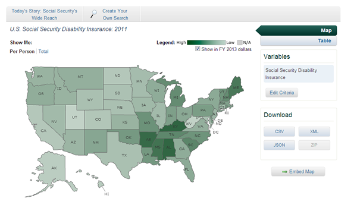
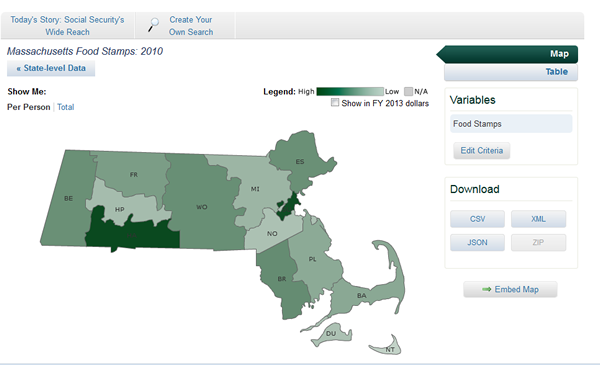
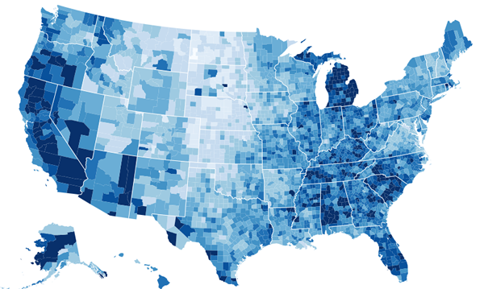

# Budget Viz Work

NPP's Federal Priorities Database generates maps about federal spending, often down to the county level. These could be more effective--right now, the site generates Flash maps with a 3rd party tool. Like this:

And you can drill into a state like this:

But what if we could show counties and states together like this.
Configurable, repeatable, choropleth maps????? http://bl.ocks.org/wrobstory/5683024

## Better Than Maps

? Are there better ways than maps to show this information?

## This Project

The point of this project is twofold:

1. Get rid of the flash maps
2. Improve our visualizations
